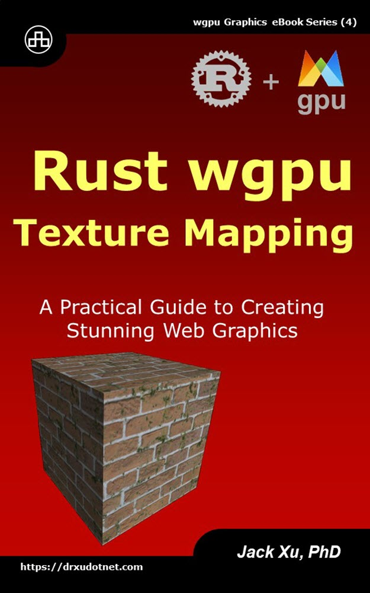

# Rust wgpu for 3D Surfaces 
## Learn How to Create 3D Surfaces using Next-Gen Rust Graphics API

This is the source code of example projects contained in the eBook ["Rust wgpu for 3D Surfaces"](https://www.amazon.com/exec/obidos/ASIN/B0CLSV3SPT/unicadinccom-20). 

